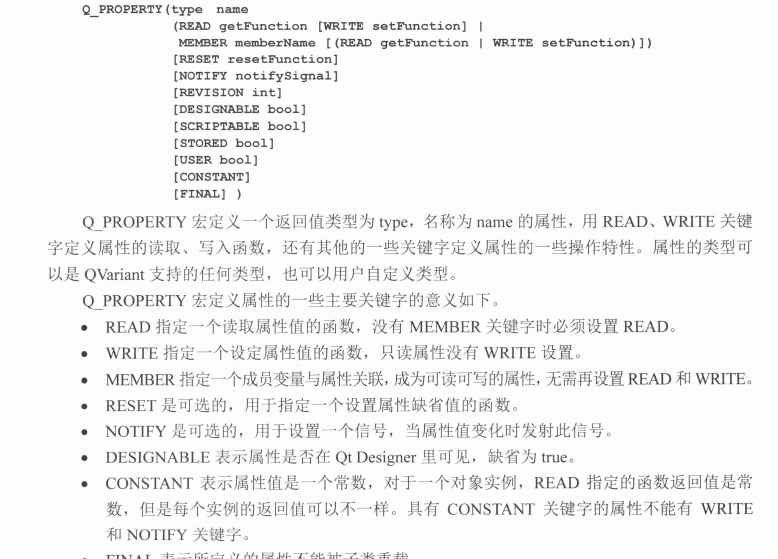

# QT
## 一、信号和槽
1. 什么是信号和槽？在QT中使用信号和槽函数进行消息之间的传递。QT的每个常用控件都有自身的信号和槽。用户在触发完成某个控件对应的操作时，则表明发射出一个信号，该信号关联的槽函数就会执行(如对界面数据的更新显示)
* 信号和槽都可以是一对一的关系、一队多的关系、多对多的关系。在信号发出后，该信号关联的一个或者多个槽函数就会根据建立关系时的顺序依次进行调用。

* 自定义信号和槽的方法，信号与槽函数的参数必须一致。

    ```c++
    // 1 method 适用于具有或者没有参数的情况。
    connect(ptr_sender, SIGNAL(function_sender(args)), ptr_receiver, SLOT(function_receiver(args)));

    //2 method 该方法适用于信号函数与槽函数的参数都具有默认值
    connect(ptr_sender, &ptr_sender::function_sender, ptr_receiver, &ptr_receiver::function_receiver);

    //3 method use lamba

    connect(ptr_sender,&ptr_sender::function_sender, [&|=| ](){});

    ```

* 多线程下的信号与槽函数。connect的最后一个参数默认（缺省）为QT::AutoConnection。

    主要有的关系有：  
    QT::DirectConnection 信号被发射时，槽函数立即执行，在同一个线程中。

    QT::QueuedConnection 在事件循环回到接收者线程后执行槽函数，槽函数与信号不在同一个线程中。

    QT::BlockingQueuedConnection 与 QT::QueuedConnection类似，只是信号线程会阻塞到槽函数线程执行完毕。不可在同一个线程中使用，会造成死锁。 

    QT::AutoConnection 信号接收者与发送者在同一个线程中，使用QT::DirectConnection,反之使用QT::QueuedConnection。


* 使用sender()函数获取发射者。，sender()会返回发射者的对象指针，如果知道发射者的类型可以使用qobject_cast<type *>(sender()) 进行转换。


## 二、 元对象
* 元对象条件：继承QObject的类、在private声明 Q_OBJECT宏（则能使用属性、信号和槽机制）；MOC（元对象编译器）为每个QObject子类提供必要的代码实现元对象系统的特性，发现Q_OBJECT宏会为这个类生产另外一个包含元对象支持代码的c++源文件，这个生产源文件连同类的实现文件一起被编译与链接。

    提供 QObject::metaObject()返回元对象

    调用className（）返回类名。

    newInstance()创建新实例。

    inherits（const char* className)判断是否为className类或子类。

    tr()、trutf8()可翻译字符串。

    setProperty()、 prperty() 设置和获取属性名称对应的值。


* 属性系统定义：


    ```c++
    //defined
    Q_PROPERTY(bool focus READ hasFocus)
    
    Q_PROPERTY(bool enabled READ isEnabled WRITE setEnabled)

    Q_PERPERTY(QCursor cursor READ cuursor WRITEsetCursor RESET unsetCursor)

    //use
    Qobject object.....
    object->setProerty("flat", truue);
    bool isFlat = object->property("flat");

    //可以使用这种机制实现QSS用法
    editLine->setProperty("required", "true");

    //*.qss中
    *[required="true"] 
    {
       background-color:lime 
    }
    ```

    